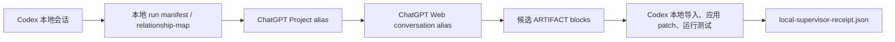

# Codex 会话、ChatGPT Project 与 Web 对话 Demo

日期：2026-05-28
状态：已落地为可运行本地 demo

## 结论

本地代码可以由 Codex 打成安全上传包，再由用户手动上传到 ChatGPT Project sources 或当前 Web 对话附件中，让 ChatGPT Web 使用它的文件分析和容器能力承担主要阅读、分析、任务分解、起草 patch/report 的工作。默认 Project alias 是 `harness-dev-test`。

但这不是“把代码推到 ChatGPT 的项目库里让它自动维护”，也不是让 Codex 稳定遥控 chatgpt.com 会话。真实上传、模型选择和发送动作仍然发生在 ChatGPT Web 产品界面里，必须由用户确认。

三个对象的边界如下：



- Codex 本地会话：权威 supervisor。负责选择本地 workspace、脱敏打包、导入 artifact、应用 patch、运行测试、写 receipt。
- ChatGPT Project：ChatGPT 产品侧的长期上下文容器。可以放项目指令、用户手动上传的文件和相关对话，但不是本地 Git 仓库，也不是本地执行权限。上传到 Project sources 的包会成为更持久的项目上下文，旧包过期时需要用户在 ChatGPT Web 里手动删除。
- ChatGPT Web conversation：一次 run 或一次 attempt 的工作面。用户在这里手动选择模型、确认上传、确认发送；它可以产出候选 patch/report，但不能自称本地验收通过。

本地只持久化用户可读 alias，不保存真实 ChatGPT Project ID、conversation ID、share link、cookie、session、localStorage、OAuth token 或浏览器存储。

## 回答你的问题

“能把本地代码直接打包传到项目的库上面吗？”可以，但准确说法是：

1. Codex 把允许范围内的本地文件打成 `source-files.zip` 和 `source-files-manifest.json`。
2. 用户手动上传到 ChatGPT Project sources，或只作为当前对话附件上传。
3. ChatGPT Web 在产品侧读取这个上传包并起草候选 artifact。
4. 本地 Codex supervisor 把 artifact 导回真实 repo，先校验 `codex-execution-plan.json` 并写 `codex-dispatch-receipt.json`，再应用 patch，运行测试，写 receipt。

这个包不是新建或伪造的 Git 仓库，也不是把目录名拼出来的假项目结构。普通文件用真实工作区相对路径保存，并保留当前 dirty worktree 中允许上传文件的内容；空目录用 zip directory entry 和 `.chatgpt-harness/directory-structure.json` 记录。包内只包含 `.chatgpt-harness/git-context.json` 这类 metadata-only Git 上下文，不上传 `.git/`、历史对象、reflog、branch refs 或远程凭据。

ChatGPT Web 可以基于上传文件返回 `ARTIFACT: changes.patch`，也可以用 `ARTIFACT: files/<relative-path>` 返回完整替换文件；生成的候选产物再由本地 Codex 验收。ChatGPT Project sources 不是 Git remote，也不是本地仓库替代品。本地是否接受仍由 Codex 的路径/hash/secret 校验、`git apply --check`、测试和 receipt 决定。

`codex-execution-plan.json` 进入本地后有两种 dispatch 路线：

- `manual` backend：只校验 execution plan，按依赖关系写出 `serial` / `parallel` batches 和 `codex-dispatch-receipt.json`，由当前本地 Codex 主会话继续决定如何执行。
- `codex-cli` backend：按同一批次规则启动本地 Codex CLI unit；串行 batch 逐个执行，parallel batch 并发执行。每个 unit 的 `prompt.md`、`stdout.jsonl`、`stderr.txt` 和 `last-message.md` 会保存在 `.tmp/chatgpt-web/<run_id>/agents/<unit_id>/`，并由 `codex-dispatch-receipt.json` 记录路径、exit code 和输出摘要。

dispatch receipt 只是“已校验并尝试调度”的证据，不是 merge/push 许可。真实修改仍必须回到本地 repo，经 `git apply --check`、项目检查和 `local-supervisor-receipt.json` 通过后，才允许由本地流程执行 merge、commit 或 push。本项目现在提供 `tools/chatgpt_web_artifact_importer.py commit-accepted` 作为最后一道本地 Git gate：它只 stage receipt 中的 `accepted_worktree_paths`，默认拒绝混入未被验收的脏文件；需要推送时必须显式传 `--push --remote <remote> --branch <branch>`。

不能做的是：

- 让本地程序静默读取 ChatGPT Web 的登录态并自动上传。
- 把 ChatGPT Project 当作 Git remote 或本地仓库替代品。
- 让 CDP/Simprint 自动证明文件已经进入 Project sources；它最多能辅助当前页面的文件输入，Project-source 上传结果仍需用户在 Web UI 确认。
- 保存 ChatGPT share URL、内部项目 ID、会话 ID 或 cookie 作为可恢复控制柄。
- 让 ChatGPT Web 直接写本地 repo、提交 git、部署或宣称验收通过。

## Demo 工具

入口：

```text
tools/chatgpt_web_project_conversation_demo.py
```

它会创建一个最小本地 git workspace，生成上传包、Project 指令模板、当前对话启动提示、关系映射文件，并能用模拟 Web 回复跑完整闭环。

### 一键离线 demo

```powershell
cd C:\Users\Administration\CodexWorkspaces\harness_agent_approve
$python = "C:\Users\Administration\.cache\codex-runtimes\codex-primary-runtime\dependencies\python\python.exe"

& $python tools\chatgpt_web_project_conversation_demo.py run-demo `
  --run-id project_demo_001 `
  --force
```

`run-demo` 使用模拟 Web 回复跑通“导入 artifact、manual dispatch receipt、应用 patch、本地测试、supervisor receipt”的闭环。它验证默认安全路径，不会启动真实 Codex CLI agent。

该命令会生成：

```text
.tmp/chatgpt-web-project-conversation-demo/project_demo_001/
  chatgpt-project-instructions.md
  chatgpt-conversation-start.md
  relationship-map.json
  storage/project_demo_001/source-files.zip
  storage/project_demo_001/source-files-manifest.json
  storage/project_demo_001/upload-manifest.json
  storage/project_demo_001/upload/project_demo_001--source-files.zip
  storage/project_demo_001/upload/project_demo_001--source-files-manifest.json
  storage/project_demo_001/upload/project_demo_001--chatgpt-web-request.json
  workspace/.tmp/chatgpt-web/project_demo_001/codex-dispatch-receipt.json
  workspace/.tmp/chatgpt-web/project_demo_001/local-supervisor-receipt.json
```

`relationship-map.json` 只记录：

- `codex_thread_ref`：本地可读 label。
- `chatgpt_project_alias`：用户自己命名的 Project alias。
- `chatgpt_conversation_alias`：用户自己命名的对话 alias。
- source bundle、manifest、prompt、response、receipt 的本地路径。
- 当前状态：prepared、simulated_web_response_ready、accepted_by_local_supervisor 或 rejected_by_local_supervisor。

它不会记录真实 ChatGPT URL、内部 ID、cookie、token 或 share link。

如需单独演示 `codex-cli` backend 的落盘行为，可在 `simulate-web-response` 或 `run-demo` 生成并导入 `codex-execution-plan.json` 后执行：

```powershell
& $python tools\chatgpt_web_project_conversation_demo.py dispatch-fake-codex `
  --run-id project_demo_001
```

该命令使用 fake Codex CLI 验证 dispatcher 会按 batch 调用 CLI backend，并写出每个 unit 的 prompt/stdout/stderr/last-message 与 `codex-dispatch-receipt.json`。它用于演示调度和证据路径，不代表真实代码已通过验收。

### 真实 Web 手动流程

先准备包：

```powershell
& $python tools\chatgpt_web_project_conversation_demo.py prepare-demo `
  --run-id project_demo_live_001 `
  --chatgpt-project-alias harness-dev-test `
  --chatgpt-conversation-alias demo-conversation-live-001 `
  --force
```

`prepare-demo` 默认使用 Project sources 上传模式；只有明确想把文件限制在当前对话附件时，才传 `--upload-target conversation`。

然后打开生成的 `upload-manifest.json`：

- 如果 `upload_target` 是 `project_sources`，先人工检查 `source-files-manifest.json`，再把 `project_sources_files` 上传到 ChatGPT Project `harness-dev-test` 的 sources / files 区域。
- 真实上传时使用 `upload/` 目录里带 `{run_id}--` 前缀的文件；不要上传同名裸文件替代它们。
- 为这个本地 `run_id` 新开一个 ChatGPT Web conversation，不要把多个本地 run 混在同一个对话里。
- 把 `chatgpt-conversation-start.md` 或 `chatgpt-web-task-prompt.md` 的内容发给 ChatGPT Web。用户仍需手动选择目标模型并确认发送。
- 如果不想污染 Project sources，把 `--upload-target conversation` 作为当前对话附件上传即可。

ChatGPT Web 返回后，把最新回复保存为：

```text
.tmp/chatgpt-web-project-conversation-demo/project_demo_live_001/storage/project_demo_live_001/raw-response.txt
```

再让 Codex 本地验收：

```powershell
& $python tools\chatgpt_web_project_conversation_demo.py complete-demo `
  --run-id project_demo_live_001
```

只有 `local-supervisor-receipt.json` 里 `local_gate_status` 为 `passed`，才算这次 run 被本地接受。

如果要把通过验收的结果提交到真实仓库，继续运行本地 commit gate：

```powershell
& $python tools\chatgpt_web_artifact_importer.py `
  --workspace-root .tmp\chatgpt-web-project-conversation-demo\project_demo_live_001\workspace `
  commit-accepted `
  --receipt .tmp\chatgpt-web-project-conversation-demo\project_demo_live_001\workspace\.tmp\chatgpt-web\project_demo_live_001\local-supervisor-receipt.json `
  --message "Accept ChatGPT Web supervised demo change"
```

如需推送到已配置 remote，再显式添加 `--push --remote origin --branch <branch-name>`。这一步只提交 receipt 接受的真实 worktree 路径；`.tmp/` 下的 Web 回复、dispatch receipt、agent stdout/stderr 等证据不会被当作代码变更提交。

如果 demo workspace 或目标仓库没有配置 Git identity，`commit-accepted` 会在 `git commit` 处失败；在目标仓库内设置 `git config user.name ...` 和 `git config user.email ...` 后重试。

## 与 ChatGPT App Connector 的关系

如果不需要 ChatGPT Web 直接调用本地工具，优先使用上面的手动上传/导入流程，不需要公网 IP 或 HTTPS tunnel。

如果希望 ChatGPT Web 直接通过工具提交候选 artifact，才使用 Apps SDK / MCP connector。此时 connector 仍只是受限 artifact inbox：

- 可以列出预注册 workspace alias。
- 可以生成 source bundle。
- 可以接收候选 `changes.patch` / `report.md`。
- 可以读取本地 supervisor receipt。
- 不可以运行 shell、启动 Codex、应用 patch、提交 git、部署或读取 secrets。

模型选择发生在 ChatGPT Web 当前对话里，Apps SDK connector 本身不规定模型，也不消耗本地 OpenAI API key。

## 本次实现的新增字段

`chatgpt-web-request.json` 会记录：

- `chatgpt_project.alias`：默认 `harness-dev-test`。
- `chatgpt_project.upload_target`：默认 `project_sources`，也可显式改为 `conversation`。
- `chatgpt_project.persistent_sources_allowed`：只有 `project_sources` 为 true。
- `chatgpt_conversation.alias`：用户可读对话标签。
- `chatgpt_conversation.one_to_one_with_local_run`：固定为 true。
- `user_instruction`：如果使用主 harness 的 `--user-instruction` 或 `--user-instruction-file`，这里会保存脱敏后的用户附加指引来源和内容。
- `output_contract.required_artifacts`：现在包含 `codex-execution-plan.json`、`report.md`、`changes.patch` 和 `testing-guide.md`。

`codex-execution-plan.json` 是 ChatGPT Web 给本地 Codex supervisor 的任务分解建议。它用英文运行时字段描述哪些 work unit 应串行执行、哪些可并行执行、各自拥有的路径、依赖关系和最终验收命令。demo 会校验该文件并写 `codex-dispatch-receipt.json`；真正拉起 subagent 或 SDK agent 的动作仍由当前本地 Codex 主会话执行。

当前 dispatcher 支持 `manual` 和 `codex-cli` 两个 backend。`manual` 只写调度分组和待执行 receipt；`codex-cli` 会实际启动本地 `codex exec` unit，并保存 prompt、stdout、stderr 和 last message。无论哪个 backend，dispatch receipt 都不是本地验收 receipt；真实 merge、push 或发布仍要等 `local-supervisor-receipt.json` 通过后由本地 `commit-accepted` / 目标项目自己的 delivery gate 执行。

`upload-manifest.json` 会把同一批本地文件分成：

- `packet_type`：固定为 `chatgpt_web_upload_manifest`，可由 `tools/validate_chatgpt_web_manual_assist.py` 离线校验。
- `project_sources_files`：上传到 Project sources。
- `conversation_attachment_files`：只上传到当前对话。
- `operator_steps`：用户需要在 ChatGPT Web 手动执行的步骤。
- `user_instruction` / `user_instruction_source`：主 harness 获取到的用户附加指引和来源，便于人工上传前复核。
- `run_identity`：记录本次 `run_id`、`task_id`、`workspace_id`、Project/conversation alias、upload target、source bundle hash、source manifest hash、request hash 和 prompt hash。人工上传前必须用它核对 prompt、request、manifest 和 Project Sources 文件是否来自同一次 run。

### Project Sources stale / mixed-run 风险

上传到 Project sources 的文件会成为 ChatGPT Project 较持久的产品侧上下文；本地 run 结束后，ChatGPT 不会自动删除旧 sources。因此真实 Web 流程里必须执行这些检查：

- 本次上传文件必须来自 `upload-manifest.json.upload_files`，并全部带当前 `{run_id}--` 前缀。
- 如果 Project sources 区域里还留着旧 run 的 `source-files.zip`、`source-files-manifest.json` 或 `chatgpt-web-request.json`，应先删除或明确不让 ChatGPT 使用。
- 如果 ChatGPT Web 返回内容显示它看到的是旧 run 的 request、manifest、bundle hash 或 prompt，应判定为 mixed-run 输入，不应应用其 `changes.patch`。
- composer 附件和 Project Sources 是两个不同输入面。`upload-files` 默认可能命中 composer 附件；要辅助 Project Sources 上传，必须在 sources 页面确认文件输入索引并使用 `--file-input-index <n>`，然后仍由用户在 UI 中确认 sources/files 区域出现本次 run-scoped 文件。

`relationship-map.json` 会记录 source bundle hash、文件数、总字节数和 stale bundle 删除提醒。它仍然只保存 alias 和本地路径，不保存真实 ChatGPT 内部 ID 或 URL。

主 harness 还会在 storage root 维护 `chatgpt-web-conversation-index.json`，防止两个不同本地 run 复用同一个 ChatGPT Web conversation alias。demo 的 `relationship-map.json` 用于说明关系，真实防重由主 harness 索引执行。

## 官方边界参考

- OpenAI 帮助中心的 [ChatGPT Projects](https://help.openai.com/en/articles/10169521-chatgpt-projects) 说明把 Project 描述为可组织 chats、files 和 instructions 的工作区。
- OpenAI Developers 的 [Apps SDK](https://developers.openai.com/apps-sdk/) 文档把 Apps SDK 定位为在 ChatGPT 中扩展应用，并基于 MCP server / MCP apps / tools 接入产品体验。
- 因此 Apps SDK / MCP connector 是工具接入面，不是本地程序静默控制 chatgpt.com 会话、选择模型、自动上传 Project sources 或绕过本地验收的接口。

因此本项目采用“用户手动确认上传与发送 + 本地 Codex receipt gate”的设计。
